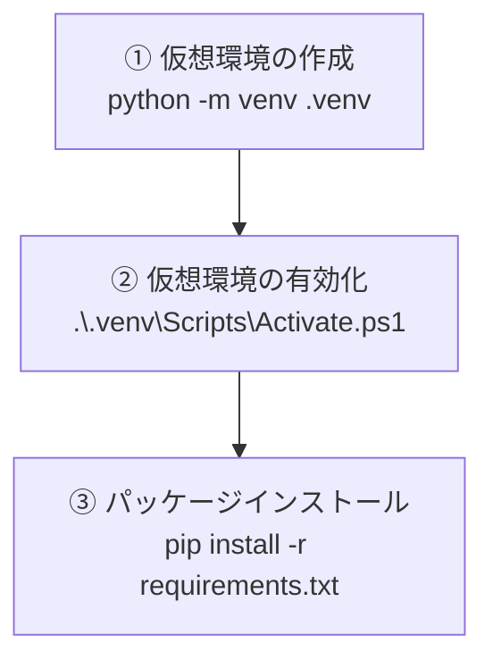
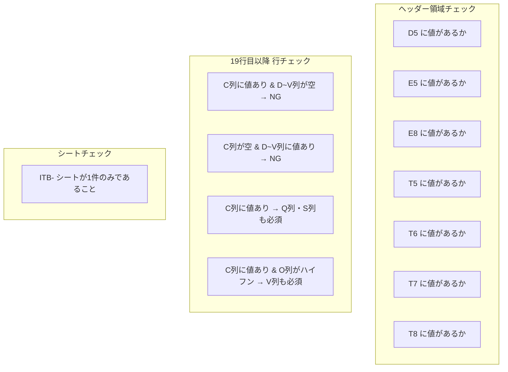

# ITB- Excel ファイル進捗チェッカー

指定フォルダ配下の `ITB-` で始まる Excel ファイルを検証し、結果を Excel に出力するツールです。

## 全体の流れ


## 前提条件

- Python 3.10 以上
- PowerShell

Python 未インストールの場合は [python.org](https://www.python.org/downloads/) からダウンロードしてください。  
インストール時に **「Add Python to PATH」にチェック** を入れてください。

## セットアップ



```powershell
cd <プロジェクトフォルダのパス>
python -m venv .venv
.\.venv\Scripts\Activate.ps1
pip install -r requirements.txt
```

> **注意:** `このシステムではスクリプトの実行が無効になっています` というエラーが出る場合は、先に以下を実行してください。
>
> ```powershell
> Set-ExecutionPolicy -ExecutionPolicy RemoteSigned -Scope CurrentUser
> ```

有効化されるとプロンプトの先頭に `(.venv)` と表示されます。

## 実行方法

仮想環境を有効化した状態で以下を実行します。

```powershell
python checker.py
```

フォルダ選択ダイアログが表示されるので、検証対象のフォルダを選択してください。  
検証結果は選択フォルダ内に `検証結果_YYYYMMDD_HHMMSS.xlsx` として出力されます。

## 検証ルール



| # | チェック内容 |
|---|------------|
| 1 | D5 に値が入っていること |
| 2 | E5 に値が入っていること |
| 3 | E8 に値が入っていること |
| 4 | T5 に値が入っていること |
| 5 | T6 に値が入っていること |
| 6 | T7 に値が入っていること |
| 7 | T8 に値が入っていること |
| 8 | 19行目以降: C列に値（関数以外）があって D\~V列に値がない行が存在しないこと |
| 9 | 19行目以降: C列に値がなく D\~V列に値がある行が存在しないこと |
| 10 | 19行目以降: C列に値がある場合、Q列・S列にも値があること |
| 11 | 19行目以降: C列に値がありO列がハイフン(-)の場合、V列に値があること |
| 12 | ITB- で始まるシートが1件のみであること |

## 出力ファイルの形式


1ファイルで複数のエラーがある場合、エラーの数だけ行が出力されます。

## exe ファイルの作成


### ビルドコマンド

```powershell
pyinstaller --onefile --windowed --name "ITB_Checker" checker.py
```

### 出力先

```
dist\ITB_Checker.exe
```

この exe ファイルは Python がインストールされていない PC でもそのまま実行できます。  
`dist\ITB_Checker.exe` を任意の場所にコピーして配布してください。ダブルクリックで起動します。
